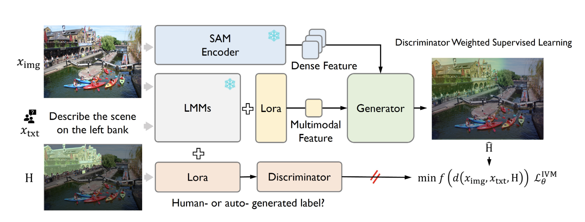

## This is all the materials for Tsinghua-AIR-Lab

# Learning Path
- Contrastive Learning 
- CLIP
- DecisionNCE
- Diffusion model（DDPM）
- bearobot
- Diffusion for robot learning
- IVM （Instruction-guided Visual Masking）（https://arxiv.org/html/2405.19783v1）
  

- DWBC（Discriminator-Weighted Offline Imitation Learning） （https://github.com/ryanxhr/DWBC） （https://arxiv.org/abs/2207.10050）
- LCBC (Language-Conditioned Behavior Cloning)
